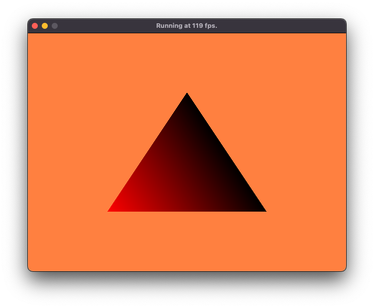
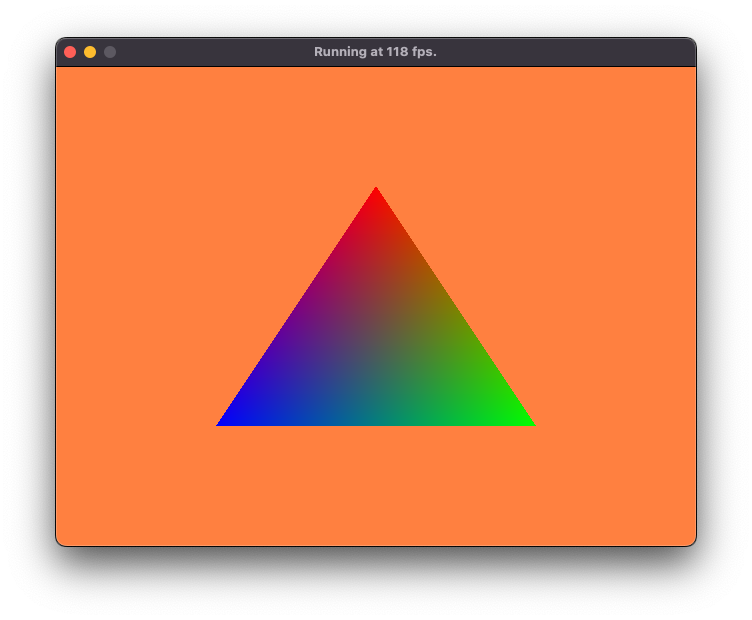

# Vulkan Issue

Rendering one simple triangle with the colors red, green, blue ends in black, black, red on Mac mini (Late 2014) with macOS Monterey (12.6.5) and Intel HD Graphics 5000 1536 MB. The Vertex Shader does not have custom attributes nor uniforms, just local variables.

Result:



Expected/Fixed:



Vertex-Shader:

```
#version 450

// vulkan NDC:	x: -1(left), 1(right)
//				y: -1(top), 1(bottom)

vec2 positions[3] = vec2[](
	vec2(0.0, -0.5),
	vec2(0.5, 0.5),
	vec2(-0.5, 0.5)
);

vec3 colors[3] = vec3[](
	vec3(1.0, 0.0, 0.0),
	vec3(0.0, 1.0, 0.0),
	vec3(0.0, 0.0, 1.0)
);

layout(location = 0) out vec3 fragColor;

void main() {
	// Initial code: black, black, red triangle
	gl_Position = vec4(positions[gl_VertexIndex], 0.0, 1.0);
	fragColor = colors[gl_VertexIndex];
	
	// Test 1: if-else-cascade using indices (works)
	/*gl_Position = vec4(positions[gl_VertexIndex], 0.0, 1.0);
	if (gl_VertexIndex == 0) {
		fragColor = colors[0];
	} else if (gl_VertexIndex == 1) {
		fragColor = colors[1];
	} else if (gl_VertexIndex == 2) {
		fragColor = colors[2];
	}*/
	
	// Test 2: if-else-cascade using gl_VertexIndex as index (fails: black, black, red triangle)
	/*gl_Position = vec4(positions[gl_VertexIndex], 0.0, 1.0);
	if (gl_VertexIndex == 0) {
		fragColor = colors[gl_VertexIndex];
	} else if (gl_VertexIndex == 1) {
		fragColor = colors[gl_VertexIndex];
	} else if (gl_VertexIndex == 2) {
		fragColor = colors[gl_VertexIndex];
	}*/
	
	// Test 3: swapped order (works)
	/*fragColor = colors[gl_VertexIndex];
	gl_Position = vec4(positions[gl_VertexIndex], 0.0, 1.0);*/
}
```

## Dependencies

* [CMake 3.1+](https://cmake.org/download/)
* [GLFW3](https://www.glfw.org)
* [Vulkan SDK](https://vulkan.lunarg.com/sdk/home)

## How to build and run 

macOS + Xcode:

```
cd vulkan/12\ -\ Rendering/Finished/
cmake -G Xcode -B build -S .
open build/VulkanTutorial.xcodeproj/
# build + run (CMD+R)
```

macOS + Make:

```
cd vulkan/12\ -\ Rendering/Finished/
cmake -B build -S .
cd build
make -j4
cd ..
./build/VulkanTutorial
```
